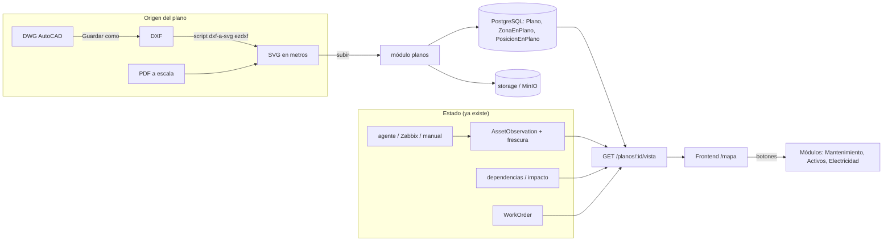

# Arquitectura · Plano Vivo (Monitoreo sobre plano real)

> Propuesta del 28/09/2026, tras la reunión con Producción y Mantenimiento.
> Prototipo de referencia (datos de ejemplo): https://claude.ai/artifact/6bZk1Vtj4qoNUCo7bouRya

> **Estado (28/09/2026, tarde):** bloques 151 y 152 HECHOS, 153 a medias (conos, cable vs 90 m y altura; faltan polígonos de zona). Diferencias con este documento: las posiciones se guardan en **píxeles de la imagen** (no en metros) para que corregir la escala no mueva nada; no se crearon permisos nuevos (mirar = `asset.read`/`activos.mirar`/`om.mirar`; gestionar = `location.manage`); `ZonaEnPlano` y rutas quedan para 153–154. Ver CLAUDE.md §80.

## 1. La idea en una línea

SGIT pasa a tener **dos capas**: **Monitoreo** (un plano a escala real, entrada principal para técnico, producción y mantenimiento) y **Gestión** (los módulos que ya existen, agrupados por dominio). El plano **ve y manda, no hace** (§58): cada botón de la tarjeta lleva al módulo donde se trabaja.

## 2. Lo que se reutiliza y lo que es nuevo

El mapa **no calcula nada que el sistema ya calcule**. Solo agrega geometría.

| El mapa necesita… | Ya existe en SGIT | Nuevo |
|---|---|---|
| Estado de cada equipo | `AssetObservation` + `monitoreo/frescura.ts` (vigencia 15 min → «no lo sé desde hace X») | — |
| Qué cae si cae un switch/tablero | `network/dependencias.ts`, `network/impacto.ts` | — |
| Cámaras caídas y su OM | `dashboard/camaras-caidas.service.ts`, `WorkOrder` | — |
| Switch, puerto, PoE | `AssetCamera.switchPort`, `poeSourcePort` | — |
| Energía | módulo `electricidad` (tableros + QR `/t/:id`) | — |
| Criticidad y preventivo | `criticidad`, `PreventivePlan` | — |
| Zona, tren, cómo llegar en texto | árbol `Location` (`howToGet`, `siglaTren`, `ETAPA`) | — |
| Dónde está el plano y a qué escala | — | **`Plano`** |
| Dónde está cada equipo en metros | — | **`PosicionEnPlano`** |
| Contorno de cada zona | — | **`ZonaEnPlano`** |
| Por dónde se camina | — | **`NodoDeRuta` / `TramoDeRuta`** (fase 3) |

`PhotoKind.PLANO` («a futuro») y `DocumentCategory.PLANO` quedan como están: son fotos y documentos, no geometría.

## 3. Diagrama



## 4. Modelo de datos (Prisma, migración aditiva)

```prisma
enum EstadoPlano { BORRADOR PUBLICADO ARCHIVADO }
enum OrigenPosicion { MANUAL BLOQUE_DWG }

model Plano {
  id              String      @id @default(uuid())
  locationId      String      // TREN / AREA / SALA del árbol
  location        Location    @relation(fields: [locationId], references: [id])
  version         Int
  estado          EstadoPlano @default(BORRADOR)
  archivoFileId   String      // SVG optimizado para mostrar (storage)
  origenFileId    String?     // DWG/DXF/PDF original: permiso aparte
  anchoM          Float       // tamaño real del dibujo en metros
  altoM           Float
  metrosPorUnidad Float       // sale de la calibración
  rotacionNorte   Float       @default(0)
  publicadoPorId  String?
  publicadoEn     DateTime?
  notas           String?
  creadoEn        DateTime    @default(now())
  zonas           ZonaEnPlano[]
  posiciones      PosicionEnPlano[]
  @@unique([locationId, version])
  @@map("planos")
}

model ZonaEnPlano {
  id         String   @id @default(uuid())
  planoId    String
  plano      Plano    @relation(fields: [planoId], references: [id], onDelete: Cascade)
  locationId String   // ZONA / SALA / ETAPA del árbol
  location   Location @relation(fields: [locationId], references: [id])
  poligono   Json     // [[x,y], ...] en metros
  @@map("zonas_en_plano")
}

model PosicionEnPlano {
  assetId      String
  asset        Asset          @relation(fields: [assetId], references: [id], onDelete: Cascade)
  planoId      String
  plano        Plano          @relation(fields: [planoId], references: [id], onDelete: Cascade)
  x            Float          // metros desde el origen
  y            Float
  alturaM      Float?
  rumbo        Float?         // grados, 0 = este, horario
  anguloVision Float?
  alcanceM     Float?
  origen       OrigenPosicion @default(MANUAL)
  colocadoPorId String?
  colocadoEn   DateTime       @default(now())
  @@id([assetId, planoId])
  @@map("posiciones_en_plano")
}
```

Reglas:
- Publicar una versión nueva **copia** las posiciones de la anterior; la anterior pasa a `ARCHIVADO`. Nada se borra.
- Un equipo sin posición en el plano publicado de su área aparece en **«sin colocar»**: el sistema dice lo que no sabe.
- Todo cambio (subir, calibrar, mover, publicar) va a `AuditLog`.

## 5. Backend · módulo `planos`

| Endpoint | Permiso | Qué hace |
|---|---|---|
| `POST /planos` | `plano.manage` | Sube SVG/PDF/PNG + ubicación. Crea BORRADOR. |
| `PATCH /planos/:id/calibracion` | `plano.manage` | Dos puntos + distancia real → `metrosPorUnidad`, norte, origen. |
| `PUT /planos/:id/zonas` | `plano.manage` | Polígonos enlazados al árbol. |
| `PUT /planos/:id/posiciones` | `plano.manage` | Colocación en lote (arrastrar y soltar). |
| `POST /planos/:id/publicar` | `plano.manage` | Versiona y archiva el anterior. |
| `GET /planos/:id/vista` | `plano.read` | Todo en una respuesta: geometría + estado + resumen por zona + `datoDe`. |
| `GET /planos/:id/estado` | `plano.read` | Solo estados (ligero, con ETag). Se consulta cada 30 s. |
| `GET /planos/:id/original` | `plano.original.read` | El DWG/PDF original. Solo supervisor. |

- **La vista se recorta por rol y ámbito** (mismo `FiltroAmbito` / jefe de tren): Producción no recibe IP, puertos ni credenciales; el técnico no recibe el original.
- **Estado**: se arma con `frescura.ts`. Sin dato vigente → gris «sin dato desde HH:MM». Nunca verde por defecto.
- **Tiempo real**: fase 1 con consulta cada 30 s; SSE después. Automático de verdad solo con agente/Zabbix (pendiente de TI).

## 6. Frontend

- **`/mapa`** = entrada principal. Componentes en `components/mapa/`: `PlanoSvg` (pan, zoom, pellizco), `CapaZonas`, `CapaEquipos`, `CapaCobertura`, `CapaRed`, `CapaEnergia`, `TarjetaHud` (una por rol), `Minimapa`, `Escala`, `BuscarEnMapa` (código → vuela al punto).
- **Base del plano como `<image href>` dentro del SVG**, no como SVG insertado: una imagen no ejecuta scripts (un SVG subido puede traer JavaScript).
- **Vista por rol**: se elige sola según el rol del usuario; se puede cambiar si tiene permiso.
- **Tarjeta = mensajero**: «Ir a la orden» → `/mantenimiento?om=…` (ya existe el filtro por `?om=`), «Generar OM» → alta con el activo precargado, «Ficha» → Activos.
- **Editor `/mapa/editar/:id`** (solo `plano.manage`): calibrar, dibujar zonas, arrastrar desde «sin colocar», publicar.
- Muchos equipos: con más de ~1500 íconos, agrupar al alejarse o pasar la capa a canvas.

## 7. Menú (Gestión por dominios)

**Monitoreo** (Mapa) · **Trabajo** · **Activos** · **Red y energía** · **Planta** · **Documentación** · **Indicadores** · **Sistema** (solo admin).
No se borra ninguna pantalla: cambia `Layout.tsx` y `verificar-menu.cjs`.

## 8. Verificadores nuevos

- **`verificar-mapa-mensajero.cjs`**: en `components/mapa/*` y `pages/Mapa.tsx` no hay `api.post/patch/put/delete` (el editor queda fuera). Se prueba metiendo una llamada a propósito.
- **Spec de la vista**: dato vencido → «sin dato»; Producción no recibe IP ni puerto.
- **Spec de calibración**: dos puntos a 60 m → coordenadas correctas; con los dos puntos en el mismo sitio, error claro.

## 9. Fases

| Fase | Qué entrega | Necesita |
|---|---|---|
| **0 · Menú por dominios** | Menos módulos a la vista, nada se pierde. | Nada. Se puede hacer ya. |
| **1 · Plano de un área** | Modelo + subir SVG/PDF + calibrar + colocar + `/mapa` de solo lectura con estado real y tarjeta por rol. Plano demo con prefijo `DEMO-` y `demo:borrar`. | El plano de **una** área. |
| **2 · Capas y métricas** | Zonas con color, cobertura, impacto de switch/tablero, cable vs 90 m, altura ≥ 1,8 m. | Puertos y PoE cargados en esa área. |
| **3 · Estás aquí y rutas** | «Estás aquí» al **escanear el QR** de un tablero o gabinete (dentro de la nave no hay GPS); ruta por pasillos y tiempo a pie. | Dibujar los pasillos una vez. |
| **4 · DWG directo y vivo** | Importar DXF con bloques CÓDIGO (se colocan solos), SSE, agente de monitoreo. | TI (agente) y el DWG con capa CCTV. |

## 10. Riesgos y condiciones

- **Plano confidencial**: solo con sesión, marca de agua con el usuario, original con permiso aparte, sin descarga para técnicos.
- **SVG con scripts**: se muestra como imagen; el servidor además limpia el archivo al subirlo.
- **DWG en la nube**: la conversión DXF→SVG la corre Mantenimiento en su PC (script), no se sube el DWG si no hace falta.
- **Colocación**: la hace una persona una vez por equipo; mientras no esté colocado, «sin colocar».
- **Dato viejo**: la pantalla dice de cuándo es cada dato (`frescura`), nunca finge estar en vivo.
